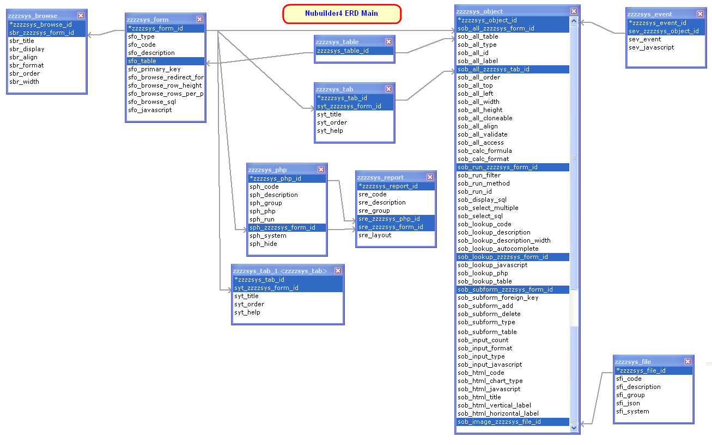
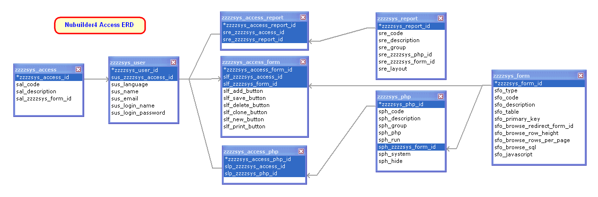
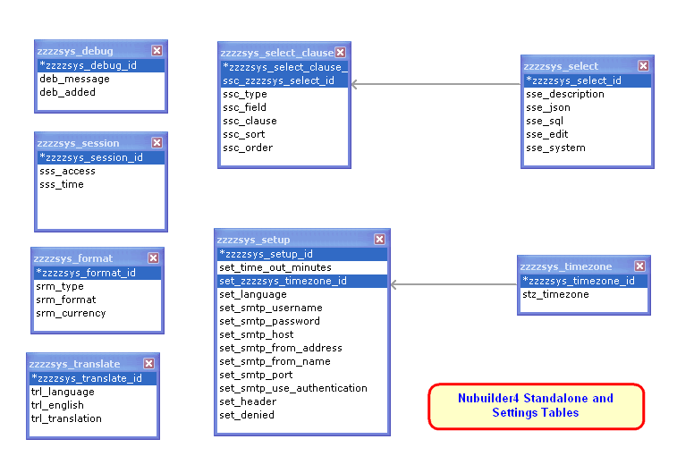
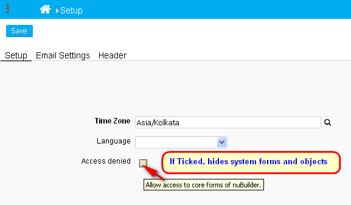

## Entity Relationship Diagram (ERD) for Nubuilder4

#### Main set of tables


#### User Access Permissions ERD


#### Standalone and Settings ERD


## set_denied to hide system forms and objects
***Setup => set_denied*** can be ticked to hide all NuBuilder's forms and objects. Useful for developers. Needs updated [nucommon.js](https://github.com/apmuthu/nubuilder4/commit/50deab677e2268cc0a970300297f5211a2a1fab9#diff-3be85bba7d935c8a483a53d3409983f33c617c6249f3983239015abb6dc73719)


Existing users can backport this feature with:
```sql
UPDATE `zzzzsys_form` SET `sfo_javascript` = '$(\'#set_header\').addClass(\'html\');\n  \n$(\'.html\').dblclick(function() {\n	nuOpenAce(\'HTML\', this.id);\n});\n\nnuHide(\'nuDeleteButton\');\nnuHide(\'nuCloneButton\');\n\nnuSetToolTip(\'set_denied\',\'Allow access to core forms of nuBuilder.\', true);\n' WHERE `zzzzsys_form_id` = 'nusetup';

INSERT INTO `zzzzsys_object` (`zzzzsys_object_id`,`sob_all_zzzzsys_form_id`,`sob_all_table`,`sob_all_type`,`sob_all_id`,`sob_all_label`,`sob_all_zzzzsys_tab_id`,`sob_all_order`,`sob_all_top`,`sob_all_left`,`sob_all_width`,`sob_all_height`,`sob_all_cloneable`,`sob_all_align`,`sob_all_validate`,`sob_all_access`,`sob_calc_formula`,`sob_calc_format`,`sob_run_zzzzsys_form_id`,`sob_run_filter`,`sob_run_method`,`sob_run_id`,`sob_display_sql`,`sob_select_multiple`,`sob_select_sql`,`sob_lookup_code`,`sob_lookup_description`,`sob_lookup_description_width`,`sob_lookup_autocomplete`,`sob_lookup_zzzzsys_form_id`,`sob_lookup_javascript`,`sob_lookup_php`,`sob_lookup_table`,`sob_subform_zzzzsys_form_id`,`sob_subform_foreign_key`,`sob_subform_add`,`sob_subform_delete`,`sob_subform_type`,`sob_subform_table`,`sob_input_count`,`sob_input_format`,`sob_input_type`,`sob_input_javascript`,`sob_html_code`,`sob_html_chart_type`,`sob_html_javascript`,`sob_html_title`,`sob_html_vertical_label`,`sob_html_horizontal_label`,`sob_image_zzzzsys_file_id`) VALUES
('5fdba6246ffc449','nusetup','zzzzsys_setup','input','set_denied','Access denied','nu5bad6cb36d97acd',40,157,217,20,18,'1','left','0','0','','','','','','','','','','stz_timezone','stz_timezone','0',NULL,'nutimezone','',NULL,'zzzzsys_timezone','','','','','','',0,'','checkbox','','','','','','','','');

```

## [Deployment NuBuilder4 Migration](https://forums.nubuilder.com/viewtopic.php?f=19&t=10120#p19867)

### Moving from development environment to deployment environment and destination target database
1. Export the whole DB to an SQL file and import the db dump to the destination target database.
1. Copy the `nuBuilder` files to the target location.
1. Update the `nuconfig.php` file

### Access data from more than one database
* NuBuilder does not support multiple databases as yet.
* You can however, use the PHP BE (Before Edit) to load data from another db.

### Clone a form or report from one development environment to another
* There is no direct way but you can copy the corresponding rows from source to destination.
* Data is mainly stored in these tables:
````
zzzzsys_object
zzzzsys_form
zzzzsys_php
zzzzsys_tab
zzzzsys_event
zzzzsys_report
````

### SQL Cleanup
In the `zzzzsys_form` table, `sfo_code = zzzzsys_form_id` for all system forms.
The kinds of `zzzzsys_form_id` that has only blank `sob_all_table` field value are:
```sql
SELECT * FROM zzzzsys_form WHERE sfo_type = 'launch';
```

The following `sob_all_table` field values can be blanked out in the `zzzzsys_object` table:
```sql
SELECT * FROM `zzzzsys_object` 
  WHERE `sob_all_zzzzsys_form_id` IN 
    (SELECT zzzzsys_form_id FROM `zzzzsys_form` WHERE sfo_type='launch')
  AND COALESCE(sob_all_table,'') <> ''
  AND sob_all_type <> 'run';
```

The following `sob_browse_sql` field values in `zzzzsys_form` table can be blanked too:
```sql
SELECT zzzzsys_form_id, sfo_type, sfo_code, sfo_description, sfo_table, sfo_browse_sql 
FROM `zzzzsys_form` WHERE sfo_type='launch' AND COALESCE(sfo_browse_sql, '') <> '';
```

Remove records with blank `sph_php` field in table `zzzzsys_php` with:
```sql
SELECT * FROM `zzzzsys_php` WHERE COALESCE(`sph_php`, '') = '';
```

### Translations Status
```sql
/* Translation Stats */
SELECT trl_language
     , COUNT(*) AS translated_strings
     , (SELECT COUNT(DISTINCT trl_english) FROM `zzzzsys_translate` a)-COUNT(*) AS ToTranslate
FROM `zzzzsys_translate`
GROUP BY trl_language
ORDER BY translated_strings DESC;
```

### Strings yet to be translated
```sql
/* Missing Strings */

/* change @lang value for each language's strings yet to be translated */
SET @lang:='French';

SELECT a.trl_english
FROM `zzzzsys_translate` a LEFT JOIN
(SELECT b.trl_english FROM zzzzsys_translate b WHERE b.trl_language = @lang) lang
USING (trl_english)
WHERE lang.trl_english IS NULL
GROUP BY a.trl_english;
```

